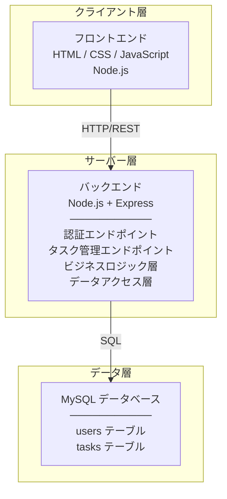
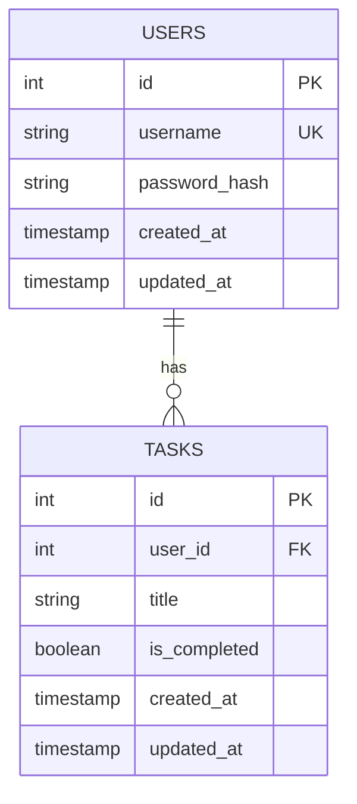
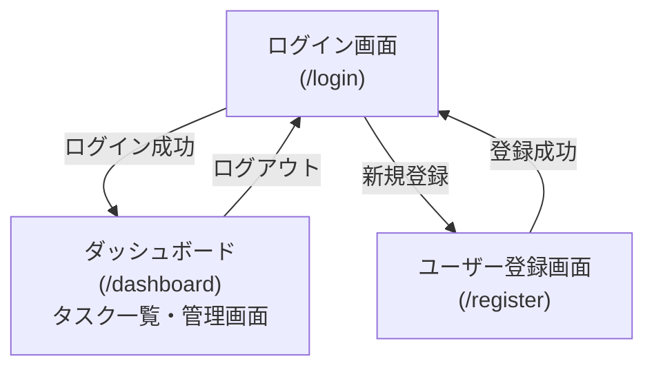

# TODO アプリケーション 設計書

**作成日:** 2025-12-09  
**バージョン:** 1.0  
**ステータス:** 確定

---

## 1. システム全体構成

### 1.1 アーキテクチャ図



### 1.2 技術スタック

| レイヤー              | 技術                                          |
| --------------------- | --------------------------------------------- |
| **フロントエンド**    | HTML5、CSS3、JavaScript (ES6+)、Node.js       |
| **バックエンド**      | Node.js、Express.js                           |
| **認証・セッション**  | bcrypt (パスワードハッシュ化)、Session/Cookie |
| **データベース**      | MySQL 8.0 以上                                |
| **ORM/Query Builder** | mysql2/promise または knex.js (検討段階)      |
| **ミドルウェア**      | express-session、helmet、body-parser          |

---

## 2. データベース設計

### 2.1 ER 図



### 2.2 テーブル定義

#### 2.2.1 users テーブル

```sql
CREATE TABLE users (
  id INT PRIMARY KEY AUTO_INCREMENT,
  username VARCHAR(50) NOT NULL UNIQUE COMMENT 'ユーザー名',
  password_hash VARCHAR(255) NOT NULL COMMENT 'パスワードハッシュ値',
  created_at TIMESTAMP DEFAULT CURRENT_TIMESTAMP COMMENT '作成日時',
  updated_at TIMESTAMP DEFAULT CURRENT_TIMESTAMP ON UPDATE CURRENT_TIMESTAMP COMMENT '更新日時',
  INDEX idx_username (username)
);
```

**カラム仕様:**

- `id`: ユーザーの一意識別子
- `username`: 1 ～ 50 文字、英数字とアンダースコア
- `password_hash`: bcrypt によるハッシュ化パスワード（60 文字固定）
- `created_at`/`updated_at`: タイムスタンプ（自動管理）

#### 2.2.2 tasks テーブル

```sql
CREATE TABLE tasks (
  id INT PRIMARY KEY AUTO_INCREMENT,
  user_id INT NOT NULL COMMENT 'ユーザーID（外部キー）',
  title VARCHAR(255) NOT NULL COMMENT 'タスク名',
  is_completed BOOLEAN DEFAULT FALSE COMMENT '完了フラグ',
  created_at TIMESTAMP DEFAULT CURRENT_TIMESTAMP COMMENT '作成日時',
  updated_at TIMESTAMP DEFAULT CURRENT_TIMESTAMP ON UPDATE CURRENT_TIMESTAMP COMMENT '更新日時',
  FOREIGN KEY (user_id) REFERENCES users(id) ON DELETE CASCADE,
  INDEX idx_user_id (user_id),
  INDEX idx_created_at (created_at DESC)
);
```

**カラム仕様:**

- `id`: タスクの一意識別子
- `user_id`: タスクの所有者
- `title`: 1 ～ 255 文字のタスク名
- `is_completed`: 完了状態（true/false）
- 外部キー制約: ユーザー削除時にタスクも削除（CASCADE）

---

## 3. API 設計

### 3.1 RESTful エンドポイント一覧

#### 3.1.1 認証関連

| メソッド | エンドポイント       | 説明               | 認証 | ステータスコード |
| -------- | -------------------- | ------------------ | ---- | ---------------- |
| POST     | `/api/auth/register` | ユーザー登録       | 不要 | 201, 400, 409    |
| POST     | `/api/auth/login`    | ユーザーログイン   | 不要 | 200, 400, 401    |
| POST     | `/api/auth/logout`   | ユーザーログアウト | 必要 | 200, 401         |

#### 3.1.2 タスク管理関連

| メソッド | エンドポイント   | 説明           | 認証 | ステータスコード   |
| -------- | ---------------- | -------------- | ---- | ------------------ |
| GET      | `/api/tasks`     | タスク一覧取得 | 必要 | 200, 401           |
| POST     | `/api/tasks`     | タスク新規登録 | 必要 | 201, 400, 401      |
| PATCH    | `/api/tasks/:id` | タスク更新     | 必要 | 200, 400, 401, 404 |
| DELETE   | `/api/tasks/:id` | タスク削除     | 必要 | 204, 401, 404      |

### 3.2 詳細仕様

#### 3.2.1 POST `/api/auth/register` - ユーザー登録

**リクエスト:**

```json
{
  "username": "user123",
  "password": "SecurePassword123!"
}
```

**レスポンス（成功 201）:**

```json
{
  "id": 1,
  "username": "user123",
  "message": "ユーザー登録が完了しました"
}
```

**エラーレスポンス（400）:**

```json
{
  "error": "バリデーションエラー",
  "details": [
    "ユーザー名は3文字以上50文字以下である必要があります",
    "パスワードは8文字以上である必要があります"
  ]
}
```

**エラーレスポンス（409）:**

```json
{
  "error": "ユーザー名は既に使用されています"
}
```

---

#### 3.2.2 POST `/api/auth/login` - ユーザーログイン

**リクエスト:**

```json
{
  "username": "user123",
  "password": "SecurePassword123!"
}
```

**レスポンス（成功 200）:**

```json
{
  "id": 1,
  "username": "user123",
  "message": "ログインしました"
}
```

**セッション管理:**

- cookie に session ID を設定
- セッションは 24 時間で有効期限切れ

---

#### 3.2.3 GET `/api/tasks` - タスク一覧取得

**クエリパラメータ:**

```
?status=all      // all, completed, pending
?search=keyword  // タスク名の部分検索
?sort=created    // created, updated
```

**レスポンス（成功 200）:**

```json
{
  "data": [
    {
      "id": 1,
      "title": "買い物に行く",
      "is_completed": false,
      "created_at": "2025-12-09T10:00:00Z",
      "updated_at": "2025-12-09T10:00:00Z"
    },
    {
      "id": 2,
      "title": "ドキュメント作成",
      "is_completed": true,
      "created_at": "2025-12-08T15:30:00Z",
      "updated_at": "2025-12-09T11:00:00Z"
    }
  ],
  "total": 2,
  "completed_count": 1
}
```

---

#### 3.2.4 POST `/api/tasks` - タスク新規登録

**リクエスト:**

```json
{
  "title": "買い物に行く"
}
```

**レスポンス（成功 201）:**

```json
{
  "id": 3,
  "title": "買い物に行く",
  "is_completed": false,
  "created_at": "2025-12-09T12:00:00Z",
  "updated_at": "2025-12-09T12:00:00Z",
  "message": "タスクが登録されました"
}
```

**エラーレスポンス（400）:**

```json
{
  "error": "バリデーションエラー",
  "details": ["タスク名は1文字以上255文字以下である必要があります"]
}
```

---

#### 3.2.5 PATCH `/api/tasks/:id` - タスク更新

**リクエスト:**

```json
{
  "title": "買い物に行く（修正版）",
  "is_completed": true
}
```

**レスポンス（成功 200）:**

```json
{
  "id": 1,
  "title": "買い物に行く（修正版）",
  "is_completed": true,
  "created_at": "2025-12-09T10:00:00Z",
  "updated_at": "2025-12-09T12:30:00Z",
  "message": "タスクが更新されました"
}
```

---

#### 3.2.6 DELETE `/api/tasks/:id` - タスク削除

**リクエスト:** なし

**レスポンス（成功 204）:** 本文なし

**エラーレスポンス（404）:**

```json
{
  "error": "タスクが見つかりません"
}
```

---

## 4. フロントエンド設計

### 4.1 画面構成

#### 4.1.1 ログイン画面 (`/login`)

**レイアウト:**

```
┌──────────────────────────────────┐
│       TODO アプリケーション       │
├──────────────────────────────────┤
│                                  │
│  ユーザー名: [__________]       │
│                                  │
│  パスワード: [__________]       │
│                                  │
│   [  ログイン  ]  [新規登録]     │
│                                  │
└──────────────────────────────────┘
```

**要素:**

- ユーザー名入力欄（type: text）
- パスワード入力欄（type: password）
- ログインボタン
- 新規登録ページへのリンク

**バリデーション:**

- 両フィールドが入力されていることを確認
- エラーメッセージは画面上に表示

---

#### 4.1.2 ユーザー登録画面 (`/register`)

**レイアウト:**

```
┌──────────────────────────────────┐
│    新規ユーザー登録               │
├──────────────────────────────────┤
│                                  │
│  ユーザー名: [__________]       │
│  (3-50文字)                      │
│                                  │
│  パスワード: [__________]       │
│  (8文字以上)                     │
│                                  │
│   [  登録  ]  [ログイン画面へ]   │
│                                  │
└──────────────────────────────────┘
```

**バリデーション:**

- ユーザー名: 3 ～ 50 文字、英数字とアンダースコア
- パスワード: 8 文字以上
- 既存ユーザー名チェック（サーバー側で実施）

---

#### 4.1.3 タスク一覧画面（ダッシュボード） (`/dashboard`)

**レイアウト:**

```
┌──────────────────────────────────────────────────┐
│  ログイン中: user123           [ログアウト]      │
├──────────────────────────────────────────────────┤
│ 検索: [______]  フィルタ: [完了] [未完了] [全て] │
├──────────────────────────────────────────────────┤
│ 新しいタスク: [__________] [追加]               │
├──────────────────────────────────────────────────┤
│  ☐ 買い物に行く              [削除] 2025-12-09 │
│  ☑ ドキュメント作成           [削除] 2025-12-08 │
│  ☐ コード審査                 [削除] 2025-12-09 │
├──────────────────────────────────────────────────┤
│ 完了: 1 / 全体: 3                               │
└──────────────────────────────────────────────────┘
```

**要素:**

- ユーザー情報表示（ユーザー名）
- ログアウトボタン
- 検索バー
- フィルタボタン（完了/未完了/全て）
- タスク新規登録フォーム
- タスク一覧
  - チェックボックス（完了状態の切り替え）
  - タスク名
  - 削除ボタン
  - 作成日時
- 統計情報（完了数/総タスク数）

**動作:**

- チェックボックスをクリックで即座に状態反映
- 完了したタスクは視覚的に区別（取り消し線、グレーアウト）
- リアルタイム検索・フィルタリング

---

### 4.2 ページ遷移図



---

### 4.3 フロントエンド技術選定

**フレームワーク:**

- 主要フレームワーク: HTML5 + Vanilla JavaScript (ES6+)
  - シンプルな実装を優先
  - 依存関係を最小化
- 代替案: 将来的に React/Vue.js への移行を検討

**スタイリング:**

- CSS3（Flexbox、Grid 対応）
- レスポンシブデザイン（モバイル対応は将来）
- ユーティリティクラス活用

**クライアント側の状態管理:**

- sessionStorage/localStorage で認証情報を保持
- 必要に応じてフロントエンドキャッシング

---

## 5. バックエンド設計

### 5.1 ディレクトリ構造

```
backend/
├── src/
│   ├── app.js                  # メインアプリケーション
│   ├── config/
│   │   ├── database.js         # DB接続設定
│   │   └── constants.js        # 定数定義
│   ├── routes/
│   │   ├── auth.js             # 認証ルート
│   │   └── tasks.js            # タスクルート
│   ├── controllers/
│   │   ├── authController.js   # 認証ロジック
│   │   └── tasksController.js  # タスク管理ロジック
│   ├── models/
│   │   ├── User.js             # ユーザーモデル
│   │   └── Task.js             # タスクモデル
│   ├── middleware/
│   │   ├── auth.js             # 認証ミドルウェア
│   │   └── errorHandler.js     # エラーハンドリング
│   └── utils/
│       ├── validators.js       # バリデーション
│       └── response.js         # レスポンスフォーマット
├── package.json
├── .env.example
└── README.md
```

### 5.2 主要モジュール仕様

#### 5.2.1 認証ミドルウェア

**機能:**

- セッション検証
- 未認証ユーザーのアクセス拒否
- 認証情報の検証

**実装例:**

```javascript
// middleware/auth.js
function authenticateUser(req, res, next) {
  if (!req.session.userId) {
    return res.status(401).json({ error: "認証が必要です" });
  }
  next();
}
```

#### 5.2.2 バリデーション

**ユーザー登録時:**

- ユーザー名: 3 ～ 50 文字、英数字とアンダースコア
- パスワード: 8 文字以上

**タスク登録時:**

- タスク名: 1 ～ 255 文字

#### 5.2.3 エラーハンドリング

**標準的なエラーコード:**

- 400: Bad Request（バリデーションエラー）
- 401: Unauthorized（認証失敗）
- 404: Not Found（リソース未検出）
- 409: Conflict（ユーザー名重複）
- 500: Internal Server Error（サーバーエラー）

---

## 6. セキュリティ設計

### 6.1 認証・認可

| 項目                     | 実装方法                                    |
| ------------------------ | ------------------------------------------- |
| **パスワードハッシュ化** | bcrypt (salt rounds: 10)                    |
| **セッション管理**       | express-session + Cookie (Secure, HttpOnly) |
| **セッション有効期限**   | 24 時間                                     |
| **CSRF 対策**            | token ベース（express-csurf 検討）          |

### 6.2 入力値検証

| 検証対象                 | 実装方法             |
| ------------------------ | -------------------- |
| **SQL インジェクション** | パラメータ化クエリ   |
| **XSS 対策**             | HTML エスケープ      |
| **バリデーション**       | 正規表現、型チェック |

### 6.3 セッション保護

- Secure フラグ: HTTPS 環境で有効
- HttpOnly フラグ: JavaScript からのアクセス禁止
- SameSite: Strict に設定

---

## 7. パフォーマンス要件

### 7.1 応答時間目標

| 機能                 | 目標応答時間 |
| -------------------- | ------------ |
| **ユーザーログイン** | 500ms 以下   |
| **タスク一覧表示**   | 1 秒以下     |
| **タスク追加**       | 200ms 以下   |
| **タスク更新**       | 200ms 以下   |
| **タスク削除**       | 200ms 以下   |

### 7.2 最適化戦略

- **データベース インデックス**: user_id、created_at、username
- **キャッシング**: セッション情報のメモリキャッシュ
- **接続プーリング**: MySQL 接続プールの設定
- **クエリ最適化**: N+1 問題の回避

---

## 8. テスト設計

### 8.1 テスト対象

| テスト種別         | 対象                         | ツール           |
| ------------------ | ---------------------------- | ---------------- |
| **ユニットテスト** | バリデーション、ロジック関数 | Jest             |
| **統合テスト**     | API エンドポイント、DB 操作  | Jest + SuperTest |
| **UI テスト**      | 画面遷移、操作フロー         | Cypress (将来)   |

### 8.2 テストケース例

**POST /api/auth/register:**

- ✅ 正常なユーザー名とパスワードで登録成功
- ❌ 既存ユーザー名で登録失敗
- ❌ ユーザー名が 3 文字未満で登録失敗
- ❌ パスワードが 8 文字未満で登録失敗

**GET /api/tasks:**

- ✅ 認証済みユーザーの全タスク取得
- ✅ フィルタ条件付きで取得
- ✅ 検索キーワード付きで取得
- ❌ 未認証ユーザーはアクセス拒否

---

## 9. デプロイメント計画

### 9.1 環境構成

| 環境           | 用途                 | サーバー構成          |
| -------------- | -------------------- | --------------------- |
| **開発環境**   | ローカル開発         | ローカルマシン        |
| **テスト環境** | テスト実行（将来）   | クラウド              |
| **本番環境**   | ユーザー運用（将来） | クラウド/オンプレミス |

### 9.2 環境変数

```env
# .env
NODE_ENV=development
PORT=3000
DB_HOST=localhost
DB_USER=root
DB_PASSWORD=password
DB_NAME=todo_app
DB_PORT=3306
SESSION_SECRET=your-secret-key-here
```

---

## 10. 開発ロードマップ

### Phase 1: MVP (最小機能製品)

- ✅ ユーザー認証（登録・ログイン・ログアウト）
- ✅ 基本的なタスク管理（CRUD）
- ✅ シンプルな UI

### Phase 2: 拡張機能（将来対応）

- ⏳ タスク検索・フィルタリング強化
- ⏳ UI/UX 改善
- ⏳ パフォーマンス最適化

### Phase 3: 高度な機能（将来対応）

- ⏳ タスク共有機能
- ⏳ 優先度管理
- ⏳ 期限設定
- ⏳ モバイル対応

---

## 11. 必要な環境・ツール

### 11.1 開発環境

| ツール      | バージョン | 用途           |
| ----------- | ---------- | -------------- |
| **Node.js** | 24.0+      | ランタイム     |
| **npm**     | 9.0+       | パッケージ管理 |
| **MySQL**   | 8.0+       | データベース   |
| **Git**     | 2.30+      | バージョン管理 |

### 11.2 依存パッケージ

**本番依存:**

```json
{
  "express": "^4.18.0",
  "mysql2": "^3.0.0",
  "bcrypt": "^5.1.0",
  "express-session": "^1.17.0",
  "dotenv": "^16.0.0"
}
```

**開発依存:**

```json
{
  "nodemon": "^2.0.0",
  "jest": "^29.0.0",
  "supertest": "^6.3.0"
}
```

---

## 12. 注意事項・制約

1. **認証方式**: セッション + Cookie を採用（JWT は将来検討）
2. **データ削除**: 物理削除（論理削除は実装しない）
3. **マルチユーザー**: 各ユーザーは自分のタスクのみ表示
4. **UI**: PC ブラウザ対応のみ（モバイルは将来）
5. **スケーリング**: 初期段階では単一サーバー構成

---

## 13. 確認チェックリスト

- [x] データベーススキーマが確定
- [x] API 仕様が確定
- [x] フロントエンド画面遷移が確定
- [x] 認証方式が確定
- [x] エラーハンドリング方式が確定
- [x] セキュリティ対策が確定
- [x] テスト計画が確定
- [x] ディレクトリ構造が確定

---

**確認者:** \***\*\*\*\*\***\_\_\_\_\***\*\*\*\*\***  
**確認日:** \***\*\*\*\*\***\_\_\_\_\***\*\*\*\*\***  
**承認者:** \***\*\*\*\*\***\_\_\_\_\***\*\*\*\*\***  
**承認日:** \***\*\*\*\*\***\_\_\_\_\***\*\*\*\*\***
